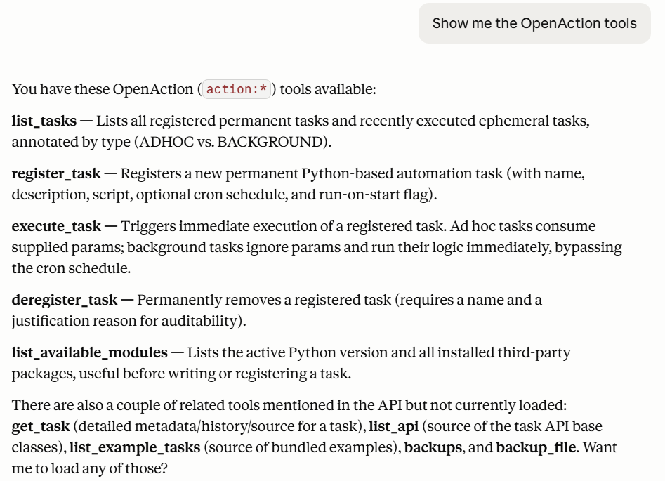
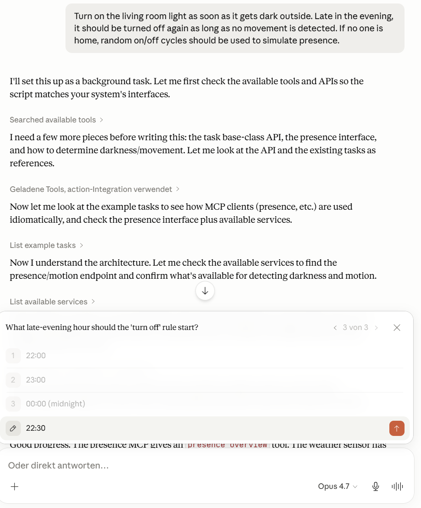
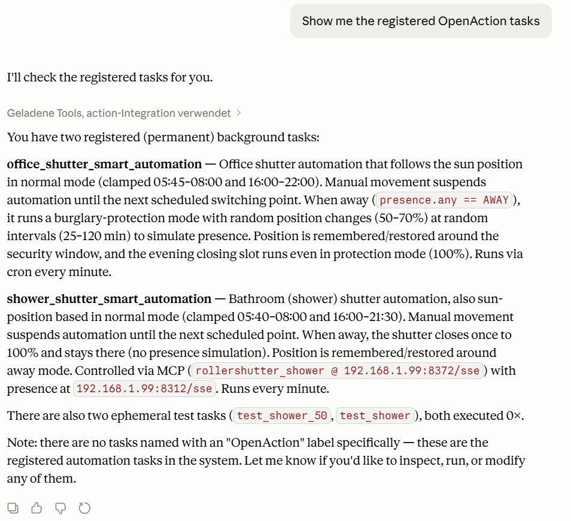

# OpenAction

**OpenAction** is an AI-native action framework for the Agentic Home.

Move beyond rigid "If-This-Then-That" rules and tedious UI-based configurations. Powered by AI agent technology,
OpenAction replaces traditional smart home solutions with flexible, adaptive logic. It helps to translate natural language
intent into dynamic, executable scripts — giving your smart home the ability to adapt, reason, and act.

Read the full architectural deep-dive on Medium: [From Smart Home to Agentic Home](articles/FromSmartHomeToAgenticHome/FromSmartHomeToAgenticHome.md)

---

## Core Features

*   **Natural Language Automation:** Define complex home behaviors via chat. No more wrestling with nested "If-Then" menus or YAML configurations.
*   **Stateful Intelligence:** An integrated `Store` provides persistence, allowing scripts to save and retrieve data across multiple executions.
*   **Dynamic Scheduling:** A built-in Cron service triggers AI-generated scripts based on time, sensor events, or external API data.
*   **Python Execution:** The AI generates standard Python code, enabling complex calculations, loops, and sophisticated error handling.

---

## Architecture & Workflow

The system acts as a bridge between high-level reasoning (Agents) and low-level hardware control. Here, the AI agent acts as a software
developer who can introspect services and write custom, deterministic Python scripts to control smart home devices.
The workflow is as follows:

1.  **The Intent:** The user describes a goal to an MCP-capable client (e.g., Claude Desktop): *"If it’s dark outside and someone is home, turn on the living room light. If we’re away, simulate presence by randomly toggling lights, ending no later than late in the evening."*
2.  **The Translation:** The Agent uses the **OpenAction MCP Server** tools to inspect available devices and writes a custom Python script.
3.  **The Registration:** OpenAction stores the script and sets up the necessary triggers (e.g., polling a weather API or listening for a sensor change).
4.  **The Execution:** When triggered, the script runs in a local sandbox, calling the endpoints of connected **Sensors & Actuators**.

---

## How to Use It


### 1. Running via Docker
You can run OpenAction as a Docker container. Use host networking to allow the server to easily discover and communicate with local network devices. Mount a local directory to preserve the working state (scripts and store data) across container restarts.

```bash
sudo docker run -d --name openaction --restart always --log-driver local --log-opt max-size=10m --log-opt max-file=3 --network host -v /etc/script/openaction:/etc/work -e devices='' grro/openaction:0.0.30
```
*Note: Make sure to map a persistent volume to `/etc/work` so that your environment state and custom scripts are not lost when the container is recreated.*


### 2. Testing with MCP Inspector
You can test the server capabilities and available tools of the running Docker container using the official MCP Inspector via Server-Sent Events (SSE):
```bash
npx @modelcontextprotocol/inspector sse http://localhost:8080/sse
```
Once started, open the provided localhost URL (e.g., `http://localhost:5173/`) in your browser to inspect the MCP tools and resources.


### 3. Integrate into Claude Desktop
To integrate OpenAction with Claude Desktop, add the MCP Server URL to the "mcpServers" section in your `claude_desktop_config.json`. 
You may use [mcp-proxy](https://github.com/sparfenyuk/mcp-proxy) to bridge the Streamable HTTP transport and the stdio MCP transport used by Claude Desktop.

```json
{
  "mcpServers": {
    "openaction": {
      "command": "mcp-proxy",
      "args": [
        "http://localhost:8080/sse"
      ]
    }
  }
}
```

### 4. Use Claude Desktop
After setting up the MCP Server and integrating it with Claude Desktop, you can start describing your desired automations in natural language. 
The Agent will be able to generate and modify the task scripts and manage their execution based on your defined triggers.


#### Explore OpenAction Tools
Here is an example showing how you can ask Claude to list all available OpenAction tools.



#### View Registered Tasks
You can easily inquire about currently registered tasks and their statuses.



#### Create a New Task
Simply instruct Claude to create new automations, and it will handle the underlying code and registration for you.



---
