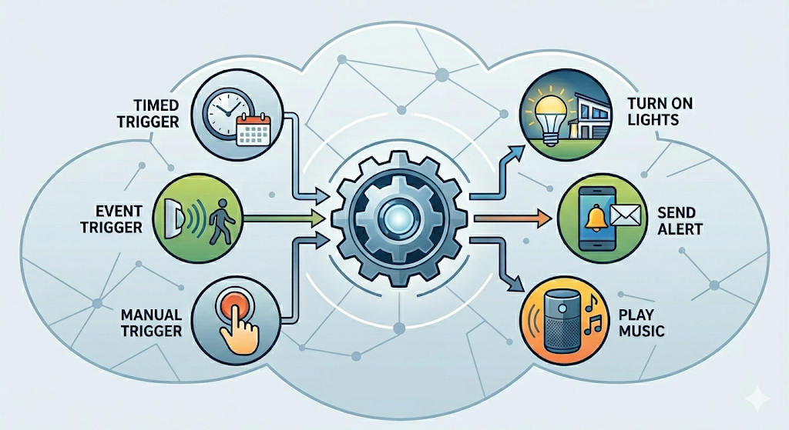
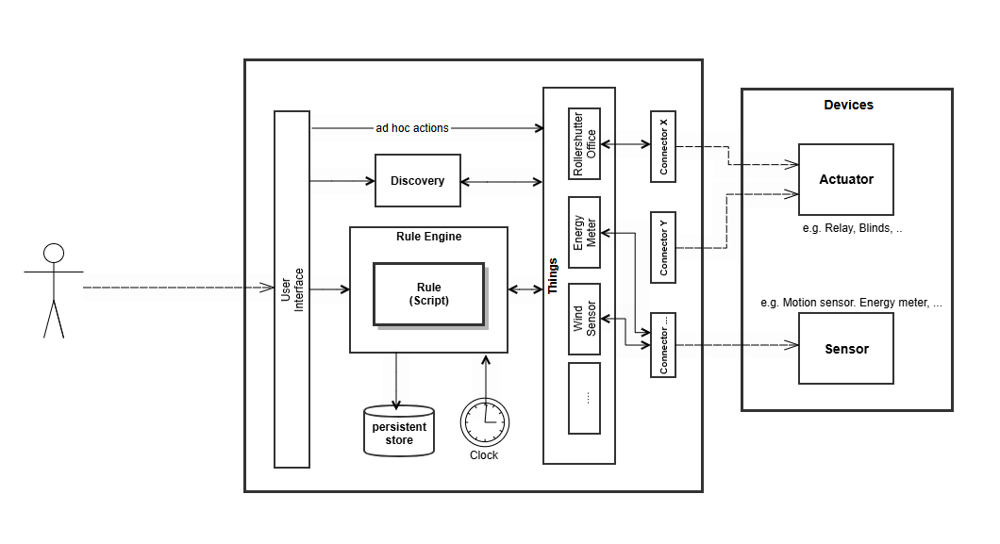
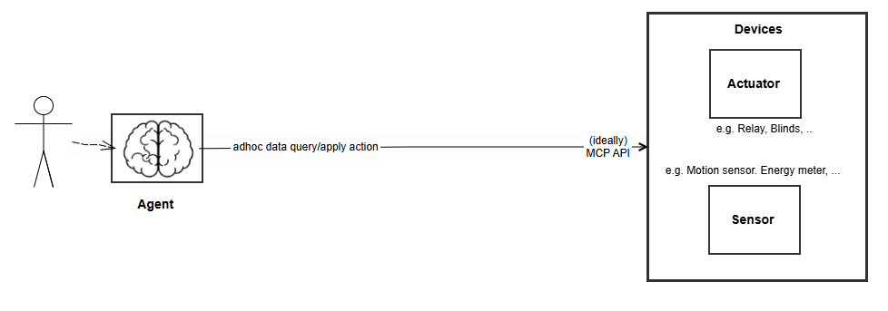
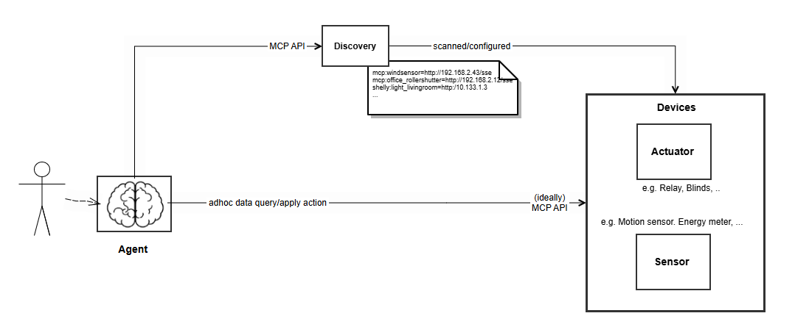
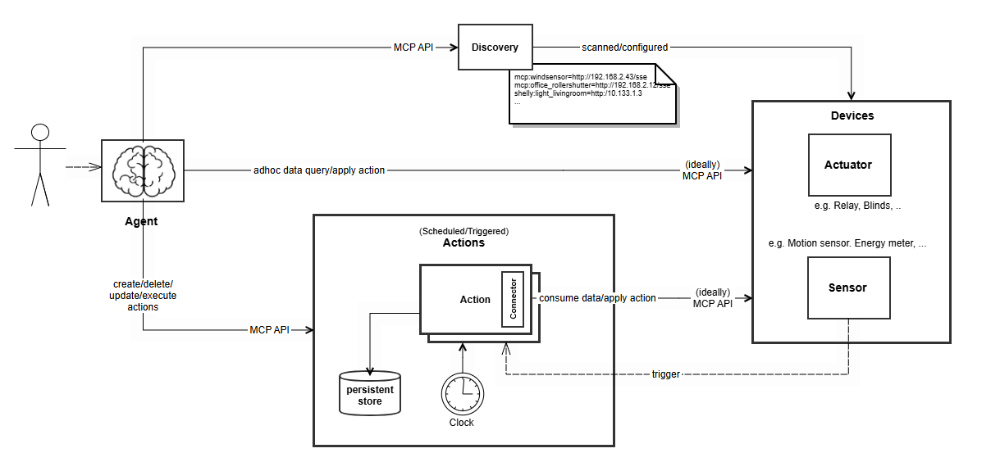

# From Smart Home to Agentic Home

*A maker's target architecture for autonomous LLM agents, MCP, and deterministic background rules.*

Traditional smart home systems continue to suffer from fragmented ecosystems and often complex,
manual configuration effort. With the next logical evolutionary step — the "Agentic Home" —
autonomous AI agents will take over central control and interact naturally with the user.

This article outlines a target architecture from a maker's perspective, demonstrating how modern
LLM agents combined with the Model Context Protocol (MCP) can enable seamless device integration
— and how deterministic background services are required to tame the unpredictable nature of AI
for mission-critical automation.

## The Traditional Smart Home Approach
Today's smart home landscape is largely defined by fragmented ecosystems. At its core, a smart
home relies on three main components: sensors, actuators, and a central hub. Sensors like motion
detectors, temperature gauges, or push buttons react to changes. Actuators, on the other hand,
translate commands into physical actions, controlling devices such as motorized blinds, heating
elements, or lighting relays. The central hub serves as the "brain" of the operation,
communicating with devices across various protocols. It orchestrates the system using predefined
"If-This-Then-That" logic alongside ad-hoc "Do-That" user commands, while also maintaining a
database of system states and events.

To function as a cohesive system, the hub must communicate with every sensor and actuator via a
specific protocol. Crucially, the choice of protocol is implicitly dictated by the hardware
device itself. Most devices only support one or a few of these standards. While open protocols
like Matter, Z-Wave, and Zigbee have gained traction, the market remains saturated with closed,
proprietary standards such as Somfy RTS or Lutron Clear Connect, as well as cloud-bound
ecosystems like Bosch Smart Home that route even local commands through the manufacturer's
servers. Manufacturers deliberately use these closed systems to tie customers to their specific
product lines — a practice known as vendor lock-in.

## Open-Source Solutions
To combat this fragmentation of user interfaces and smart home protocols, open-source platforms
like openHAB and Home Assistant have emerged with the goal of universal compatibility. They
utilize a plug-in architecture that allows new devices or protocols to be continuously integrated.

Typically, a protocol-specific connector plug-in implements a common interface, abstracting the
technical nuances of the protocol. This ensures that the technical complexities are hidden from
the automation rules. This community-driven approach even extends to closed protocols, which are
often reverse-engineered and released as community plug-ins. However, this method has a
significant bottleneck: integrating a new device type usually requires manual, explicit
programming to extend the plug-in. Overcoming this constant need for manual integration remains
one of the greatest challenges in the smart home industry today.

Users typically configure automation rules through graphical user interfaces (GUIs) or, for more
advanced setups, custom expert scripts. Further complicating the user experience, each smart home
solution typically provides its own distinct GUI. Yet, despite increasingly sophisticated
interfaces, programming a smart home to behave exactly as desired remains a daunting task for
the average user.

To improve usability, platforms such as Home Assistant have begun adding their own AI features —
a local Assist voice pipeline, native LLM integrations, and built-in MCP server and client
support. The bottleneck has thus shifted from semantic integration toward low-level protocol
bridging.

Nevertheless, these functions are still based on a hub-and-spoke topology. This article, however,
describes an "agent-first" approach in which the AI agent is no longer merely an extension of the
hub, but rather the architectural center of the system itself. Traditional smart home platforms
are reduced to providing features that the agent ecosystem does not yet cover natively.

## The Next Evolutionary Step: The Agentic Home
The next evolution in home automation — the Agentic Home — is fundamentally based on autonomous
AI agents. Instead of acting merely as a secondary layer or a voice-activated remote control,
the AI agent represents the core "brain" of the house. It serves as the central, intelligent
point of contact for the entire system. Users communicate with these AI agents to obtain
environmental information from sensors and to control actuators, often interacting via
natural voice.

Similar to locally operated smart home solutions, it is preferable to run the agent locally as
well — for both availability and privacy reasons. If the agent runs in a hosted environment, a
lost internet connection would render the entire home control almost unusable. Fully on-premises
LLMs are therefore preferred over cloud-hosted models — keeping sensitive home data, sensor
readings, and behavioral patterns entirely within the local network.

Unlike traditional smart home hubs, which rely on simple trigger conditions, AI agents are
distinguished by their ability to recognize and interpret complex, multifaceted relationships.
They don't just check whether a single sensor has been triggered; they take in the bigger
picture. This allows the agent to perform complex control tasks. For example, it can take the
time of day into account — checking whether the sun has already risen — and automatically adjust
the blinds in the home office, perfectly tailored to the user's individual work hours and daily
routines. Crucially, when user behavior or daily routines shift, the agent can dynamically adapt
the overall smart home controls without requiring manual reconfiguration.

## MCP Interface
To communicate with devices, the agent ideally uses the Model Context Protocol (MCP). In the target state, all 
actuators and sensors expose an MCP interface optimized for agentic clients. Unlike classical device APIs,
MCP is built specifically for Large Language Models (LLMs) and autonomous agents: it provides
built-in self-description, contextual metadata, and semantic meaning. An MCP interface explains
to the agent what the device is, what its current state means, and how to interact with it —
using natural language descriptions and standardized tool calls. This eliminates the need for
manually programmed plug-ins and allows the agent to dynamically discover, understand, and
operate new devices immediately.

Providing an MCP interface directly on the device leads to a highly streamlined architecture.
However, it is important to consider hardware constraints. MCP (which utilizes streamable HTTP
as one transport type) leads to higher resource consumption and network load. For devices with
sufficiently powerful processors, constant power supply, and LAN/WLAN capabilities (such as
smart energy meters, advanced lighting controllers, or modern motorized blinds), direct MCP
support is highly viable.

However, the "MCP-on-device" vision is currently more a future target state than the status quo.
With the exception of dedicated (maker) projects — such as the author's own
[presence sensor](https://github.com/grro/presence) or [wind sensor](https://github.com/grro/windsensor)
— providing MCP capabilities today almost always requires a bridge layer in practice. The same
limitation applies to battery-operated sensors that rely on wireless, energy-saving protocols
(like Thread). Maintaining an active MCP connection would drain the battery too
quickly. For these devices, MCP bridges are deployed to translate the agent's semantic MCP
commands into the lightweight, low-power protocols required at the edge.

While MCP is incredibly powerful, the number of active MCP servers must be managed carefully to
avoid overwhelming the LLM's context window. Connecting too many MCP endpoints simultaneously
may lead to "context bloat," where tool descriptions, schemas, and resources consume a large
portion of the available tokens. Consequently, intelligent, dynamic management of MCP servers
— loading and unloading tools as contextually needed — is a major focus in current MCP ecosystem
development.

In practice, however, empirical tests have shown that running 20 local MCP servers simultaneously
with Claude Desktop works reliably.

## Dynamic API Learning
The existence of MCP does not mean that agents are unable to handle other protocols. On the
contrary, AI agents are capable of writing connectors on the fly by learning the interface of
the device or by referencing the public API documentation of potential hardware. For example,
it is often straightforward for an agent to recognize a widely used device like a Shelly Relay
and introspect it via standard HTTP requests. Particularly with simple, HTTP-based protocols and
popular smart home devices, the necessary connector code can be dynamically generated and
executed by the agent, eliminating the wait for community-developed plug-ins.

While syntax errors during the dynamic generation of these connectors are typically caught and
self-corrected by the agent, a residual risk remains. The agent might generate code that is
syntactically correct but functionally flawed — for example, turning on the heating instead of
turning it off. Security mechanisms are therefore a critical aspect of dynamic code generation:
since the agent autonomously controls actuators, it may execute actions that are potentially
dangerous or cost-intensive. The execution environment for dynamically generated code should be
designed to minimize potential damage — for instance through isolated dry runs and test
executions before activation, capability-based restrictions on which devices a generated script
may control, and human-in-the-loop confirmation for safety-critical actuators such as heating
or locks.

## Discovery of Devices
Compared to dynamically generating access code, identifying new devices on the network is a more
difficult challenge. The AI agent should not simply run aggressive port scans across the entire
network, as this is problematic from a security perspective.

To solve this, the mDNS (Multicast Domain Name System) standard may be used as the primary
method for local device discovery. mDNS allows devices to broadcast their presence and available
services on a local network without requiring a central DNS server. When a new smart device
connects to the Wi-Fi, it broadcasts a standardized message into the network (e.g., "I am an
energy meter, reachable at this IP address, and I offer an MCP API"). The AI agent can passively
listen to these multicasts and immediately recognize that a new device is available to be
integrated.

However, mDNS has distinct limitations. First, it is strictly bound to the local subnet. If a
user separates their smart home devices into a dedicated VLAN (Virtual Local Area Network) for
security reasons, the mDNS broadcast will not reach the AI agent. Furthermore, mDNS only tells
the agent that a device exists and what its IP is; it does not automatically provide the
semantic context or authentication keys required to control it — which is exactly where the
Model Context Protocol (MCP) steps in.

A prominent example of how powerful mDNS-based discovery can be is the Matter protocol. Matter
defines a comprehensive discovery and commissioning workflow on top of mDNS, combined with a
standardized device data model. However, this mechanism applies only to devices within the
Matter ecosystem — non-Matter devices remain invisible to it.

## Extending the Agent: Deterministic Action Services
By leveraging the MCP interfaces of discovered devices, the agent can seamlessly use the exposed
tools and resources to query real-time sensor data and trigger precise state changes on actuators.

While state-of-the-art agents excel at handling ad-hoc, real-time commands ("Do-That"),
continuous background processing presents a unique challenge. Relying on an LLM to constantly
monitor recurring events or environmental triggers introduces non-deterministic risks, where
hallucinated behavior can quietly cause harm over time without immediate user oversight.

To overcome this, the agent's architecture is extended by a dedicated, deterministic Action
Service. Rather than reverting to a traditional, isolated smart home hub, the Action Service
acts as the agent's execution arm, running safely and predictably on its behalf.

An architectural study of such a framework, developed by the author, is available at
[OpenAction](https://github.com/grro/openaction). Within this ecosystem, the agent functions
as a dynamic developer: it reasons about routines, synthesizes the required logic into an action
script, and deploys it directly to the Action Service. Crucially, if a specific driver or
connector is not natively available within the execution infrastructure, the agent can bundle
the necessary communication code directly into the rule script itself. For example, an
automation script written to toggle an exterior light using a Shelly relay can seamlessly
encapsulate the raw, Shelly-specific HTTP API call code directly inside its own execution block.

Once a script is generated and deployed, its day-to-day operation runs completely independently
of the AI agent to guarantee real-time safety and eliminate context overhead. However, the agent
always retains full authority to refactor, optimize, and adapt these background rules whenever
behavioral patterns or user routines shift. To support continuous adaptations, the Action Service provides an 
execution history to the agent.

## Conclusion
The transition from a traditional "Smart Home" to an "Agentic Home" represents a fundamental
paradigm shift in how we interact with our living spaces. We are moving away from rigid,
manually programmed hub-and-spoke models — and even beyond simple semantic voice commands —
toward an autonomous, reasoning ecosystem.

For the author, the architecture outlined here is already in daily use: Claude Desktop serves
as the MCP host and orchestrating agent — pending a viable on-premises alternative. At the edge
are self-built MCP devices and bridges, HABPanel (openHAB) reduced to a pure dashboard role,
and the Action Service running deterministic background rules.

The biggest open challenge in the current OpenAction service — the reference implementation of
the Action Service architecture — is the production-grade realization of the security mechanisms
outlined earlier: in particular reliable sandboxing of dynamically generated code and seamless
human-in-the-loop verification for safety-critical actuators.